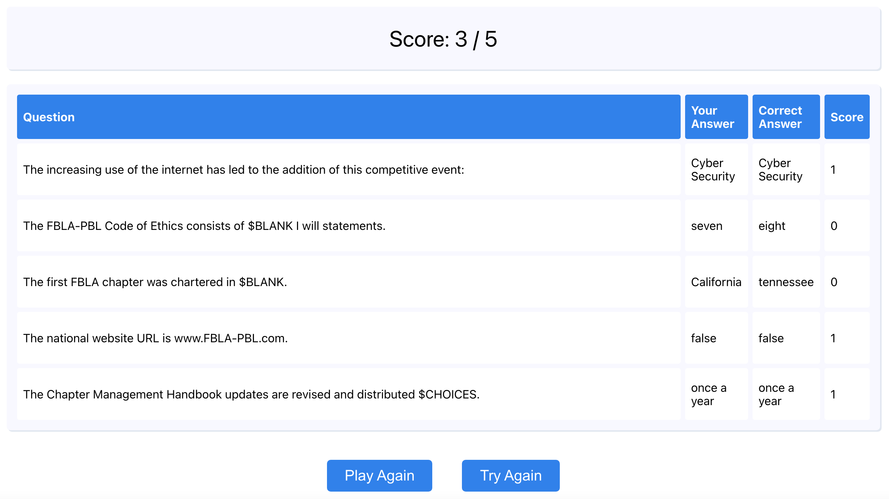

# About the Project
This project was made for the Coding & Programming  event at California FBLA SLC.   
It features an original computer program that generates a five-question quiz.  
Demo: [https://quizfbla.herokuapp.com/](https://quizfbla.herokuapp.com/)  
Github Repository: [https://github.com/hannahjzhang/fblaquiz](https://github.com/hannahjzhang/fblaquiz)  

# To Run
1. cd into the repo: `cd fblaquiz`
2. install npm: `npm install`
3. run the app in development mode `npm start`
4. open [http://localhost:3000](http://localhost:3000) to view it in the browser

# How to Use
The initial screen features a set of 5 questions that were randomly generated from a database.  
* Four Types of Questions
  * Multiple choice: choose the best answer within 4 possible answers
  * Fill in the blank: fill the best word to complete the sentence
  * True/false: choose whether the statement is true or false
  * Dropdown: among the options in the dropdown menu, choose the best answers
* Buttons
  * Check Answer: see the number of questions you have answered correctly
  * Submit: submit your answers and see in detail what you have answered correctly/incorrectly
* Image

After clicking Submit, a screen with submission details shows up.  
* Details
  * The top string of text represents the final score
  * The table below states the question, your answer, the correct answer, and the score for that specific questions
* Buttons
  * Play Again: randomly generates another five questions so that you take another version of the quiz
  * Try Again: takes you back to your original questions to try Again
* Image

# How to Navigate the Folders
* src – Description of Important Files:
  * App.css: contains the styling for the questions page
  * Results.css: contains the styling for the page with results page
  * data.js: contains the database of 50 questions stored in json format
  * App.js: runs the Question component
  * Quiz.js: creates a Question component that displays the questions and runs commands accordingly
  * components/ResultScreen.js: creates and return the table with the results
* public:
  * index.html: basic site setup
  * quiz.ico: favicon photo
  * questionpage.png & resultspage: photos for readme

# How This Was Made
This project was bootstrapped with [Create React App](https://github.com/facebook/create-react-app).  
You can learn more in the [Create React App documentation](https://facebook.github.io/create-react-app/docs/getting-started).
