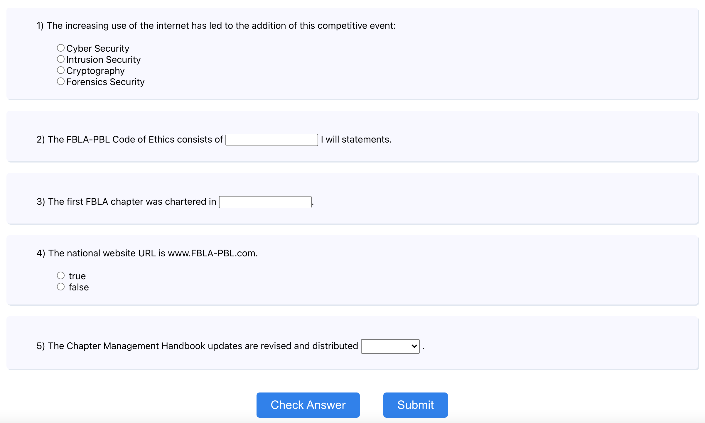

# About the Project
This project was made for the Coding & Programming  event at California FBLA SLC.  <br>
It features an original computer program that generates a five-question quiz. <br>
Demo: [https://quizfbla.herokuapp.com/](https://quizfbla.herokuapp.com/)

# To Run
1. cd into the repo: ```cd fblaquiz```
2. install npm: ```npm install```
3. run the app in development mode ```npm start```
4. open [http://localhost:3000](http://localhost:3000) to view it in the browser

# How to Use
The initial screen features a set of 5 questions that were randomly generated from a database. <br>
Four Types of Questions <br>
- Multiple choice: choose the best answer within 4 possible answers
- Fill in the blank: fill the best word to complete the sentence
- True/false: choose whether the statement is true or false
- Dropdown: among the options in the dropdown menu, choose the best answers
Buttons <br>
- Check Answer: see the number of questions you have answered correctly
- Submit: submit your answers and see in detail what you have answered correctly/incorrectly
 <br>
<br>
After clicking Submit, a screen with submission details shows up <br>
Details <br>
- The top string of text represents the final score
- The table below states the question, your answer, the correct answer, and the score for that specific questionsj
Buttons <br>

# How this was made
This project was bootstrapped with [Create React App](https://github.com/facebook/create-react-app).
You can learn more in the [Create React App documentation](https://facebook.github.io/create-react-app/docs/getting-started).
